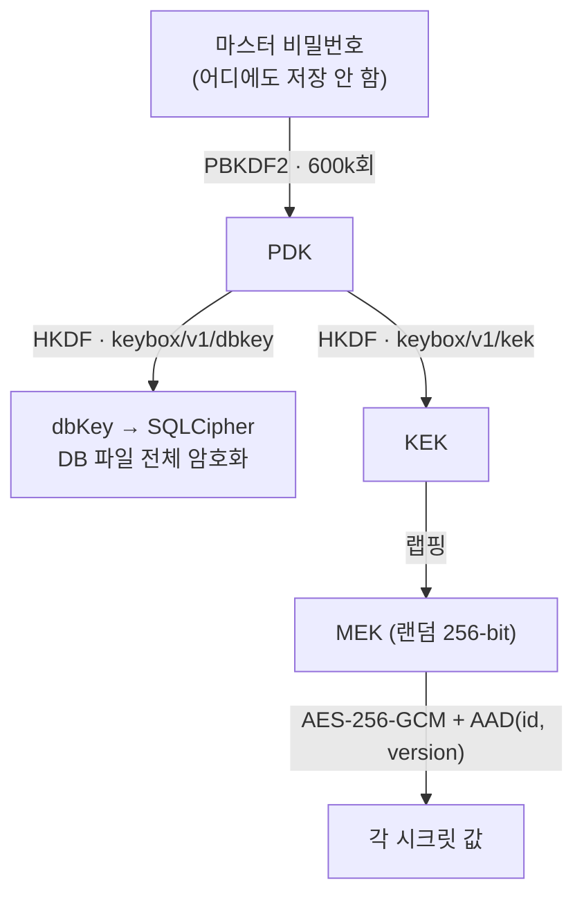

<p align="center">
  
</p>

<h3 align="center">KeyBox</h3>

<p align="center">
  macOS에서 API 키·토큰·비밀번호를 로컬로만 보관하는 시크릿 매니저.<br/>
  당신의 키는 이 Mac을 떠나지 않는다.
</p>

<p align="center">
  <a href="https://github.com/GangWooLee/key_box/actions/workflows/ci.yml"></a>
  <a href="LICENSE"></a>
  
  
</p>

<p align="center">
  <a href="README.md">English</a> · <a href="README.ko.md">한국어</a>
</p>

---

## 왜 만들었나

개발하다 보면 API 키가 `.env`, 메모장, 클립보드, 슬랙 DM에 흩어진다. 클라우드
볼트를 쓰자니 계정과 구독이 필요하고, 내 키가 남의 서버에 올라간다. KeyBox는
반대로 간다 — **모든 것이 이 Mac 안에서 끝난다.** 네트워크 권한 자체가 없고,
데이터베이스 파일은 통째로 암호화되며, 마스터 비밀번호는 어디에도 저장되지 않는다.

## 어떻게 지키나

- 🔒 **DB 전체 암호화** — SQLCipher(AES-256). 파일을 훔쳐가도 비밀번호 없이는
  `file is not a database` 에러만 본다.
- 🌐 **네트워크 제로, 계정 제로** — Release 빌드는 네트워크 entitlement 자체를
  선언하지 않는다. 유출은 코드 리뷰가 아니라 OS 샌드박스가 막는다.
- 🔑 **키 계층** — 마스터 비밀번호 → PBKDF2(600k회) → HKDF 도메인 분리 →
  시크릿별 AES-256-GCM. 비밀번호를 바꾸면 데이터 재암호화 없이 키만 재랩핑한다.
- 🛡️ **롤백 방어** — 각 암호문은 자기 행 id·버전에 GCM AAD로 묶인다. 백업에서
  옛 암호문을 슬쩍 되돌려 넣으면 복호화가 거부된다.
- 📦 **백업도 암호화** — 내보내기는 값뿐 아니라 이름·메모 같은 메타데이터까지
  암호화한 단일 `.kbx` 파일(v3). 비밀번호만 있으면 새 Mac에서도 복원된다.
- 🗂️ **폴더·검색·감사** — 다대다 폴더, ⌘K 퍼지 검색, 모든 열람을 기록하는
  append-only 감사 로그.
- ⏱️ **자동 잠금·클립보드 위생** — 유휴 시 자동 잠금이 메모리에서 키를 지우고,
  복사한 값은 30초 뒤 카운트다운과 함께 클립보드에서 비워진다.

## 스크린샷

| 열람 + 클립보드 카운트다운 | ⌘K 커맨드 팔레트 |
|---|---|
|  |  |

## 키 계층 구조



비밀번호 하나에서 독립 유도된 두 키 — DB를 여는 능력과 마스터 암호화 키를
푸는 능력이 HKDF 도메인 라벨로 분리된다. 위협 경로별 방어·수용 판정은
[docs/security-threat-model.md](docs/security-threat-model.md)에 33개 경로로
정리했고, 설계 서사는 [docs/SECURITY.md](docs/SECURITY.md)에 있다.

## 시작하기

요구사항: macOS, Flutter 3.41+, CocoaPods.

```bash
flutter pub get
dart run build_runner build --delete-conflicting-outputs   # Drift 코드 생성 (필수)
flutter run -d macos
```

실사용(dogfood)은 스크립트로:

```bash
scripts/dogfood.sh release   # HEAD 빌드 → 기존 앱 종료 → 재기동
```

빌드 없이 `open`으로 옛 .app을 띄우면 소스와 다른 바이너리를 테스트하게 된다 —
이 스크립트가 그 사고를 막는다.

## 테스트

```bash
flutter test                                  # 단위 + 위젯 (460+)
flutter test integration_test/<파일> -d macos  # cipher 실증 (파일당 1회 호출)
```

솔직한 한계 하나: macOS의 `flutter test`는 Apple 시스템 libsqlite3를 쓰기 때문에
`PRAGMA key`를 조용히 무시한다. 즉 **암호화 계층은 단위 테스트로 증명되지 않는다.**
실제 SQLCipher를 태우는 것은 `integration_test/`뿐이고, CI가 매 푸시마다 이를
실기로 돌린다(`.github/workflows/ci.yml`).

## 현재 상태

기준선 A(제작자 개인이 매일 쓰는 수준)는 도달했고 증거와 함께
[docs/completeness-scorecard.md](docs/completeness-scorecard.md)에 판정해 두었다.
남에게 설치를 권할 수준(기준선 B)까지는 격차가 남아 있다:

- **복구 수단 없음** — 마스터 비밀번호를 잊으면 데이터도 잃는다. 복구 코드는 미구현.
- **ad-hoc 서명** — Developer ID 서명·공증 전. Gatekeeper 경고가 뜬다.
- **회전 원자성** — 비밀번호 변경 중 크래시 창은 사전 자동백업 + 저널 복구
  프로토콜로 완화했을 뿐 원자적이지 않다.

## 문서 지도

| 문서 | 내용 |
|---|---|
| [docs/ARCHITECTURE.md](docs/ARCHITECTURE.md) | 코드가 어떻게 조직되어 있고 왜 그런가 — 상태 머신·provider 그래프·테스트 3계층 |
| [docs/SECURITY.md](docs/SECURITY.md) | 보안 설계 서사 — 키 계층·방어·잔여 위험 장부 |
| [docs/PRD.md](docs/PRD.md) | 무엇을 만들고 무엇을 거부했나 — 요구사항과 비목표 |
| [docs/CONTRACTS.md](docs/CONTRACTS.md) | 모듈 간 내부 계약 — 반환 규약·트랜잭션 경계·무효화 지도 |
| [docs/GLOSSARY.md](docs/GLOSSARY.md) | 용어집 (PDK·MEK·AAD·sidecar…) |
| [docs/design/DESIGN.md](docs/design/DESIGN.md) | 비주얼 디자인 정본 (V9) — 테마 토큰의 원천 |
| [docs/security-threat-model.md](docs/security-threat-model.md) | 공격자 관점 위협모델 33경로 (SECURITY의 원자료) |
| [docs/completeness-scorecard.md](docs/completeness-scorecard.md) | 완성도 판정 (증거 첨부) |
| [docs/qa-vision-e2e.md](docs/qa-vision-e2e.md) | 실앱 구동 비전 QA 루프 |
| [docs/_archive/](docs/_archive/) | 과거 과정 산출물 (정본 아님) |

스택: Flutter(macOS Desktop) · Riverpod · Drift + SQLCipher · pointycastle · GoRouter

## 라이선스

[MIT](LICENSE)
