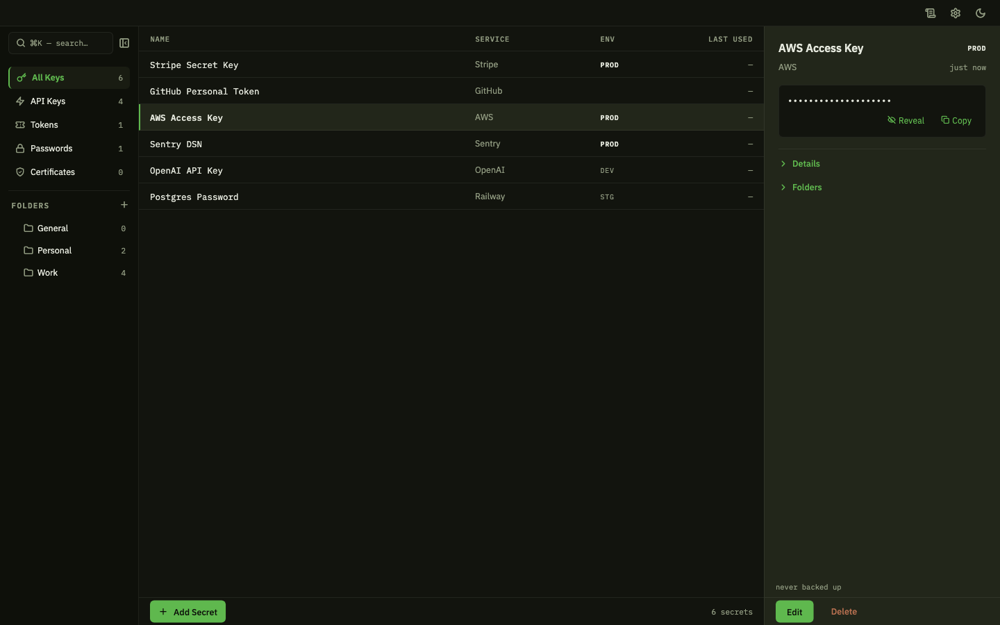
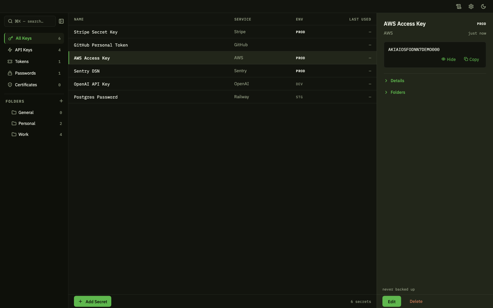
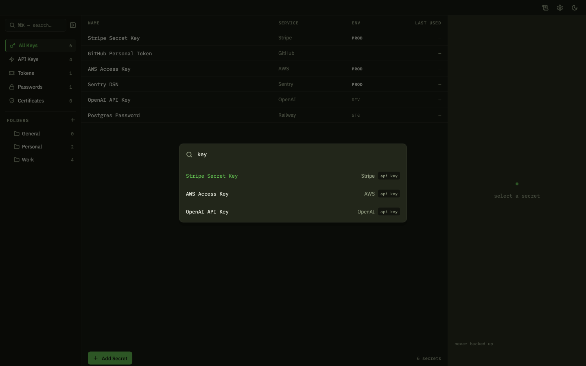
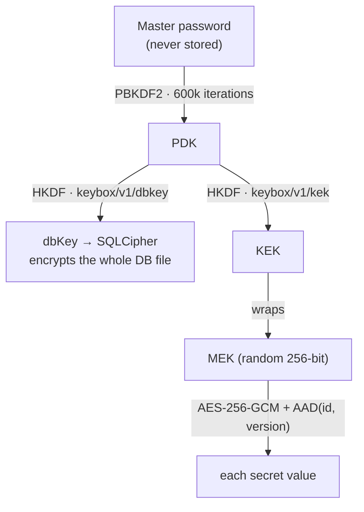

<p align="center">
  
</p>

<h3 align="center">KeyBox</h3>

<p align="center">
  Local-only encrypted secrets manager for macOS.<br/>
  Your API keys never leave your Mac.
</p>

<p align="center">
  <a href="https://github.com/GangWooLee/key_box/actions/workflows/ci.yml"></a>
  <a href="LICENSE"></a>
  
  
</p>

<p align="center">
  <a href="README.md">English</a> · <a href="README.ko.md">한국어</a>
</p>

---

## Why

Developer secrets scatter: API keys end up in `.env` files, notes apps,
clipboard history, and chat DMs — all in plaintext. Cloud vaults fix that by
adding an account, a subscription, and a copy of your keys on someone else's
server. KeyBox goes the other way: **everything stays on your Mac.** The app
has no network entitlement at all, the database file is encrypted end to end,
and your master password is never stored anywhere.

## Features

- 🔒 **Whole-file encryption** — SQLCipher (AES-256). Without the password the
  vault file is indistinguishable from random bytes.
- 🌐 **Zero network, zero account** — the Release build declares no network
  entitlement; exfiltration is blocked by the OS sandbox, not by code review.
- 🔑 **Real key hierarchy** — master password → PBKDF2 (600k) → HKDF domain
  separation → per-secret AES-256-GCM. Changing your password re-wraps keys
  without re-encrypting your data.
- 🛡️ **Rollback defense** — every ciphertext is AAD-bound to its row and
  version; splicing an old value back in fails authentication.
- 📦 **Encrypted backups** — a single portable `.kbx` file, metadata included
  (v3). Restore with only your password — on this Mac or a new one.
- 🗂️ **Folders, search, audit** — many-to-many folders, ⌘K fuzzy search, and
  an append-only audit trail of every reveal.
- ⏱️ **Auto-lock & clipboard hygiene** — idle auto-lock wipes keys from
  memory; copied values clear from the clipboard after 30 seconds with a
  visible countdown.

## Screenshots

| Reveal with clipboard countdown | ⌘K command palette |
|---|---|
|  |  |

## How it protects you



One password, two independently derived keys: the ability to open the database
and the ability to unwrap the master encryption key are separated by HKDF
domain labels. The full threat model — 33 attack paths, each judged
defended / accepted / gap — lives in
[docs/security-threat-model.md](docs/security-threat-model.md), and the design
narrative in [docs/SECURITY.md](docs/SECURITY.md).

## Getting started

Requirements: macOS, Flutter 3.41+, CocoaPods.

```bash
flutter pub get
dart run build_runner build --delete-conflicting-outputs   # Drift codegen (required)
flutter run -d macos
```

For day-to-day use, build and launch the release binary in one step:

```bash
scripts/dogfood.sh release   # build HEAD → quit old instance → relaunch
```

## Testing

```bash
flutter test                                   # unit + widget (460+)
flutter test integration_test/<file> -d macos  # cipher proof (one file per run)
```

One honest caveat: on macOS, `flutter test` loads Apple's system `libsqlite3`,
which silently ignores `PRAGMA key` — **the unit suite cannot prove
encryption.** Only `integration_test/` exercises the real SQLCipher round-trip
(wrong-key open fails, right-key open succeeds, rotation, restore), and CI
runs it on every push.

## Status

Baseline A — the author uses it daily with real secrets — is reached and
evidenced in [docs/completeness-scorecard.md](docs/completeness-scorecard.md).
Gaps to baseline B (recommending it to others) are tracked openly:

- **No recovery codes yet** — lose the master password, lose the data.
- **Ad-hoc code signing** — Developer ID + notarization pending; Gatekeeper
  will warn.
- **Rotation is crash-guarded, not atomic** — a pre-rotation backup plus a
  journaled resume protocol covers the crash windows.

## Documentation

| Document | What it answers |
|---|---|
| [docs/ARCHITECTURE.md](docs/ARCHITECTURE.md) | How the code is organized and why — state machine, provider graph, test layers |
| [docs/SECURITY.md](docs/SECURITY.md) | The security design story — key hierarchy, defenses, accepted-risk ledger |
| [docs/PRD.md](docs/PRD.md) | What it does and deliberately does not do |
| [docs/CONTRACTS.md](docs/CONTRACTS.md) | Internal contracts — return conventions, transaction boundaries |
| [docs/GLOSSARY.md](docs/GLOSSARY.md) | Terms (PDK, MEK, AAD, sidecar…) |
| [docs/design/DESIGN.md](docs/design/DESIGN.md) | The visual design source of truth (V9) — theme tokens compile from it |
| [docs/security-threat-model.md](docs/security-threat-model.md) | 33 attack paths, adversarially verified |
| [docs/completeness-scorecard.md](docs/completeness-scorecard.md) | Completeness verdicts with evidence |
| [docs/qa-vision-e2e.md](docs/qa-vision-e2e.md) | The real-app visual QA loop |

Stack: Flutter (macOS desktop) · Riverpod · Drift + SQLCipher · pointycastle · GoRouter

## License

[MIT](LICENSE)
