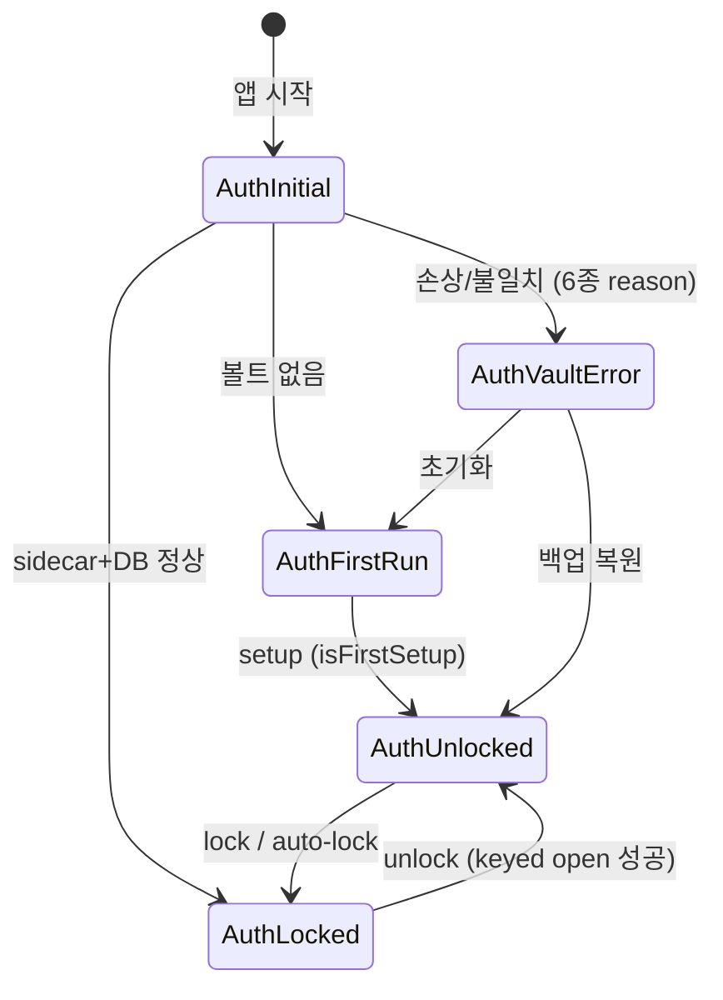
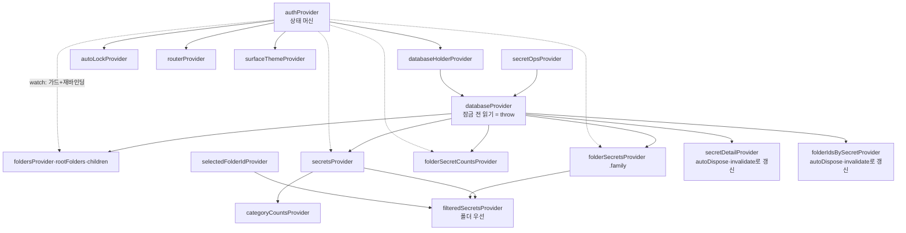

# 아키텍처

> 이 문서는 "코드가 어떻게 조직되어 있고, 왜 그렇게 생겼는가"에 답한다.
> 보안 결정의 *이유*는 [SECURITY.md](SECURITY.md), 모듈 간 약속의 세목은
> [CONTRACTS.md](CONTRACTS.md), 용어는 [GLOSSARY.md](GLOSSARY.md)가 담당한다.

## 설계를 지배한 세 가지 사실

이 앱의 구조는 임의 취향이 아니라 세 가지 제약의 결과다. 이걸 먼저 알면
나머지가 전부 자연스럽게 읽힌다.

1. **DB 자체가 잠겨 있다.** SQLCipher DB는 비밀번호에서 파생한 키 없이는 열
   수조차 없다. 그래서 "앱 시작 → DB 연결 → 화면"이라는 평범한 순서가 불가능
   하고, DB 연결이 인증 상태에 **종속**된다 — 지연(lazy) DB provider, 잠금 시
   연결 해제, 스트림 재바인딩이 전부 여기서 나온다.
2. **상태 머신이 화면을 결정한다.** 볼트는 "없음/잠김/열림/손상" 중 정확히 하나의
   상태에 있고, 어떤 화면을 보여줄지는 그 상태의 함수다. 그래서 라우팅은 화면
   목록이 아니라 `AuthState → 경로` 매핑 하나로 끝난다.
3. **UI는 DB의 그림자다.** 폴더 목록, 시크릿 목록, 사이드바 카운트는 전부 Drift
   watch 스트림의 파생이다. 쓰기가 일어나면 스트림이 다시 흐르고 UI가 따라온다
   — 수동 새로고침 코드가 원칙적으로 없다(예외 셋은 CONTRACTS의 무효화 지도).

## 한눈 지도

```
lib/
├── core/                    # 기능과 무관한 공유 인프라
│   ├── constants/           # 앱·암호화 상수 (crypto_constants가 전 파라미터 정본)
│   ├── database/            # Drift: database.dart, cipher_params, tables/ 6종, daos/ 6종
│   ├── encryption/          # PBKDF2 · HKDF · MEK wrap · 값 암호화(+secretAad)
│   ├── vault/               # sidecar_store(salt+회전 저널) · vault_migrator(평문→암호화)
│   ├── backup/              # 아카이브 v3 · 복구 오케스트레이션 · 사전회전 백업
│   ├── router/              # GoRouter + 상태 기반 redirect
│   ├── theme/               # V9 토큰의 컴파일 결과 (정본은 docs/design/DESIGN.md)
│   └── utils/               # Result<T> 등
├── features/                # 기능 모듈: 각자 domain/(Riverpod) + presentation/(UI)
│   ├── auth/                # 상태 머신의 심장 — auth_state, auth_notifier
│   ├── secrets/             # 대시보드·폴더·검색·시크릿 CRUD (앱의 본체)
│   ├── audit/  onboarding/  settings/
│   └── folders/ search/ vault/   # ⚠ 빈 스캐폴딩 — 로직은 secrets/에 있음 (아래 '정직한 흠')
├── services/                # 앱 수준: auto_lock · clipboard · window_state
└── main.dart / app.dart     # 창 초기화 → ProviderScope → MaterialApp.router
```

계층 규칙은 Presentation → Domain → Data 단방향이다. 위반이 세 곳 남아 있고,
숨기지 않는다(아래 '정직한 흠').

## 상태 머신 — 앱의 척추

[auth_state.dart](../lib/features/auth/domain/auth_state.dart)의 sealed class
6종이 볼트의 전 생애를 표현한다. sealed라서 switch가 상태 하나를 빠뜨리면
컴파일이 거부한다 — "처리 안 된 상태"라는 버그 클래스가 타입 수준에서 없다.



**부팅은 매트릭스다.** `initialize()`는 (sidecar 상태 × DB 파일 존재)의 조합을
전수 판정한다 — sidecar만 있으면 `vaultFileMissing`, DB만 암호화로 있으면
`sidecarMissing`(salt 복구 불가 → 복원/초기화만 출구), 평문 DB만 있으면 salt를
재생성해 자가 치유(self-heal). 각 오류는 `VaultErrorReason` 6종으로 분류되어
사용자에게 "왜"와 "출구"를 보여준다. 조합을 얼버무리지 않는 것이 이 설계의
요점이다: 손상은 발견 즉시 이름이 붙는다.

**라우팅은 상태의 함수다.** [app_router.dart](../lib/core/router/app_router.dart)의
redirect가 `AuthState`를 읽어 경로를 결정한다:

| 상태 | 경로 → 화면 |
|---|---|
| AuthInitial | `/loading` |
| AuthFirstRun | `/setup` |
| AuthLocked | `/unlock` |
| AuthVaultError | `/vault-error` (reason별 안내 + `/restore` 진입) |
| AuthUnlocked(isFirstSetup) | `/onboarding` |
| AuthUnlocked | `/` 대시보드 (+ `/audit-log`, `/settings`) |

화면이 "내가 지금 보여도 되나"를 각자 판단하지 않는다 — redirect 한 곳이
전권을 가지므로, 잠금이 걸리면 어느 화면에 있었든 즉시 unlock으로 밀려난다.

## DB는 인증에 종속된다 — 지연 provider 설계

여기가 이 앱에서 가장 특수한 배선이다. 일반 앱이라면 `databaseProvider`가 앱
시작 시 연결을 만들면 그만이지만, 이 DB는 키 없이 열리지 않는다.

```
authProvider (상태 머신)
    │ unlock: dbKey 파생 → openDatabase(dbKey) → databaseHolderProvider에 주입
    │ lock:   MEK zero-out → 연결 close → holder를 null로
    ▼
databaseHolderProvider (StateProvider<AppDatabase?>)
    ▼
databaseProvider  ── holder가 null이면 StateError를 던진다 (null 반환 아님)
```

`databaseProvider`가 잠금 전 읽기에 **throw로 응답**하는 것은 의도다: null을
주면 호출자가 조용히 빈 화면을 그리고, throw하면 배선 실수가 시끄럽게 죽는다.
시크릿 매니저에서 "조용한 오염"은 최악의 실패 양식이다.

이 구조의 파생 요구가 **스트림 재바인딩**이다. 잠금→해제를 거치면 DB 연결
객체가 교체되므로, 옛 연결의 watch 스트림은 죽은 스트림이 된다. 그래서 모든
데이터 스트림 provider는 `authProvider`를 watch한다 — 인증 상태가 바뀌면
provider가 재실행되어 새 연결에 스트림을 다시 문다. 이 watch를 빠뜨린 provider가
Phase 1 리뷰에서 잡힌 실결함 클래스였다(잠김 중 throw + 해제 후 스테일).

## 데이터 계층 — 스키마와 그 이유

스키마 v3, 테이블 6종: `vaults` · `vault_configs`(salt + wrappedMek — 키 재료의
유일한 DB 내 거처) · `folders` · `secrets` · `folder_secrets`(M:N 조인) ·
`audit_events`.

두 가지 설계 결정이 스키마를 읽는 열쇠다.

**폴더 소속은 M:N 조인이 진실원천이다.** `secrets.folderId` 컬럼(1:N)과
`folders.secretsCount` 캐시가 먼저 있었고, 나중에 `folder_secrets` 조인이
도입됐다. 캐시 컬럼은 쓰기 경로가 갈라지며 실제 멤버십과 어긋났다 — 그래서
카운트를 캐시가 아니라 **조인의 GROUP BY 파생 스트림**으로 바꿨다. 파생은
원리적으로 어긋날 수 없다. 옛 컬럼들은 레거시 표면으로 남아 있다(정직한 흠).

**recordVersion은 스키마에 있는 보안 장치다.** 값이 바뀔 때마다 오르는 이
정수가 GCM AAD에 들어가 롤백을 탐지한다 — 상세는 SECURITY.md.

keyed open은 연결마다 `PRAGMA key`를 **첫 문장**으로 실행하고, 이어서 cipher
하드핀 6종(page_size·HMAC-SHA512·plaintext_header_size=0 등)을 고정한다.
하드핀은 "라이브러리 업그레이드가 온디스크 포맷 기본값을 바꿔도 기존 볼트를
계속 연다"는 단방향 문 방어다.

## Provider 그래프 — 반응성의 두 등급



provider는 반응성 등급이 둘이다. 이 구분이 이 코드베이스의 상태 관리 문법이다.

- **스트림 파생(기본값)** — 목록·카운트처럼 "DB의 현재 모습"인 것. Drift watch가
  쓰기에 자동 반응하므로 갱신 코드가 없다.
- **일회성 + 명시 무효화(예외)** — detail 패널처럼 "특정 순간의 스냅샷"인 것.
  autoDispose로 수명을 좁히고, 쓰기를 한 UI가 `ref.invalidate`로 갱신을 계약한다
  (지도는 CONTRACTS.md — 현재 정확히 3곳).

왜 detail을 스트림으로 안 바꿨나: 시도했고, 위젯 테스트 11건이 깨졌다
(pumpAndSettle × drift 스트림 로딩 상호작용). 스냅샷 + 무효화가 provider 타입
계약을 보존하면서 같은 신선도를 주는 더 싼 답이었다 — "기계적으로 전부
스트림화"가 아니라 필요한 곳만 반응형이 이 그래프의 방침이다.

## 부팅에서 화면까지

```
main() ─ 창 초기화(window_manager, 저장된 bounds 복원)
  └─ ProviderScope ─ KeyBoxApp
       ├─ initState: authProvider.initialize()   ← 부팅 매트릭스 판정
       └─ MaterialApp.router(theme: surfaceThemeProvider, router: routerProvider)
            └─ redirect가 AuthState를 화면으로 번역
```

테마조차 상태의 함수다: `surfaceThemeProvider`가 auth 상태를 watch해서 잠금
화면과 대시보드의 표면 톤을 가른다(첫 해제 시 320ms 스윕 연출 포함).

## 회전·백업·복구 — 크래시를 설계에 넣기

비밀번호 변경(회전)은 "이 앱에서 유일하게 중간에 죽으면 안 되는" 연산이라
프로토콜 자체가 크래시를 전제한다: ③ 새 salt 스테이징(`.new` 저널) → ④ DB에
rewrap+salt 기록 → ⑤ `PRAGMA rekey` + WAL 체크포인트 → ⑥ 저널 승격. 각 단계
사이에서 죽은 경우를 부팅/unlock이 케이스 A·B·C로 판별해 재개하고, 시작 전에
**사전회전 백업(.kbx)을 먼저 확보하지 못하면 회전 자체를 거부**한다 — 복구망
없는 위험 연산은 시작하지 않는다는 원칙이다. 같은 이유로 회전 중의 `lock()`
요청은 거부가 아니라 **예약**된다(rekey 도중 연결을 끊으면 복구 불능 창이
생기므로 — 계약은 CONTRACTS.md).

백업 아카이브(v3)는 내보내기 전에 전 레코드를 복호 검증한다 — 손상된 백업은
만들어지지 않는다. 복원은 아카이브 검증을 끝낸 뒤에야 DB를 만들고, 각 시크릿을
새 행 id에 AAD 재바인딩해 심는다.

## 테스트 아키텍처 — 3계층과 그 이유

이 프로젝트의 테스트는 "무엇을 원리적으로 볼 수 없는가"를 기준으로 계층이
갈린다. 상세 근거는 [qa-vision-e2e.md](qa-vision-e2e.md)와 README의 한계 고지.

| 계층 | 무엇을 증명 | 무엇을 못 봄 |
|---|---|---|
| `flutter test` (496) | 로직·위젯·provider 계약 | **암호화 전부** (Apple libsqlite3가 PRAGMA key 무시) |
| `integration_test` (실앱, CI 상주) | SQLCipher 실왕복·회전·복원 | 사용자 눈에 보이는 렌더 |
| 비전 QA (실앱 구동+눈) | 실제 바이너리의 실제 화면 | (수동) |

게이트는 뮤테이션으로 실증하고(결함 주입 → RED 확인), 실앱 검증은 반드시
`scripts/dogfood.sh`를 거친 바이너리로 한다 — 소스가 고쳐졌어도 이틀 전
바이너리를 테스트하면 아무것도 증명되지 않는다는 것을 실사고로 배웠다.

## 정직한 흠 — 알고 있는 구조 부채

문서가 코드보다 깨끗해 보이면 그 문서는 거짓말을 하고 있는 것이다. 현재 알고
있는 흠은 다음과 같고, 전부 B-장부에서 관리된다.

- **계층 위반 3곳** — presentation이 DAO를 직접 호출한다:
  [folder_dialogs.dart](../lib/features/secrets/presentation/widgets/folder_dialogs.dart)의
  폴더 생성·수정·삭제, [sheet_modal.dart](../lib/features/secrets/presentation/widgets/sheet_modal.dart)의
  폴더 조회·생성 폴백, [onboarding_screen.dart](../lib/features/onboarding/presentation/screens/onboarding_screen.dart)의
  폴더 조회. FolderOperations 같은 domain 계층으로 올리는 것이 정답이나,
  동작 결함이 아니라 구조 부채라 A-필수로 다루지 않았다.
- **빈 스캐폴딩 디렉토리** — `features/folders·search·vault`는 뼈대만 있고
  로직은 `secrets/`에 산다. 지우거나 채우거나 — 다음 리팩토링 때 결정.
- **레거시 표면** — `folders.secretsCount` 캐시 컬럼(복원 경로만 사용, 신규
  호출 금지), `secretDao.watchByFolderId`(1:N 시절 잔재, UI 미사용),
  `create()`의 커밋 후 폴더 링크 창(CONTRACTS 참조).
- **감사 로그 페이지네이션** — 누적 창 방식이라 페이지가 깊어지면 재조회 비용이
  선형 증가. 개인 도구 규모에선 무해.
